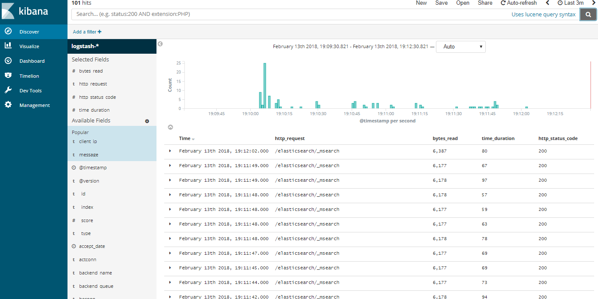

# Sending HAProxy logs to ELK

Proof of concept for sending HAProxy logs to ELK via rsyslogd

## Prerequisites

To run, you will need the following:
- Docker
- Docker Compose
- A limit on mmap counts (vm.max_map_count) 262,144 or more  

## Usage 
Run the following command
```
docker-compose build && docker-compose up
```
then open Kibana (http://docker/kibana) and set up new index pattern `logstash-*` with `@timestamp` time field. Replace _docker_ with output of `docker-machine ip` if needed.


